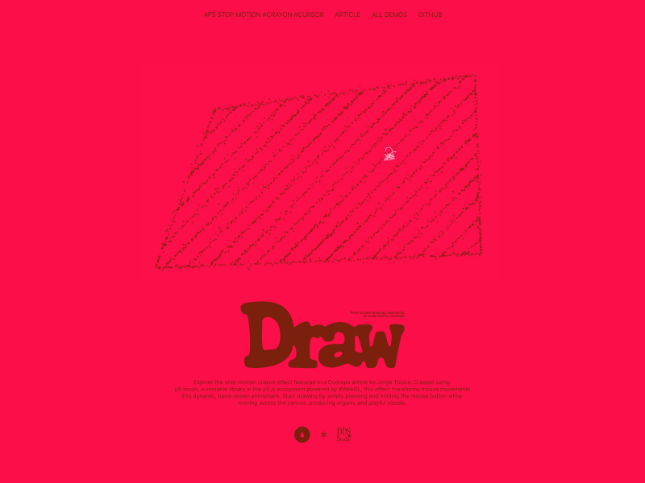

# Stop Motion Crayon Cursor

Implementation of a custom cursor with a stop motion and crayon effect using p5 Brush by [Jorge Toloza](http://jorgetoloza.co).



[Tutorial on Codrops](https://tympanus.net/codrops/?p=)

[Demo](http://tympanus.net/Development/.../)

## Installation

Install dependencies:

```
npm install
```

Compile start a local server:

```
npm run dev
```

Create the build:

```
npm run build
```

## Misc

Follow Jorge Toloza: [Website](https://jorgetoloza.co), [Instagram](https://instagram.com/jorgecapillo), [X](https://twitter.com/jorgecapillo), [GitHub](https://github.com/jorgecapillo) 

Follow Codrops: [X](http://www.X.com/codrops), [Facebook](http://www.facebook.com/codrops), [GitHub](https://github.com/codrops), [Instagram](https://www.instagram.com/codropsss/)

## License
[MIT](LICENSE)

Made with :blue_heart:  by [Jorge Toloza](https://jorgetoloza.co) and [Codrops](http://www.codrops.com)