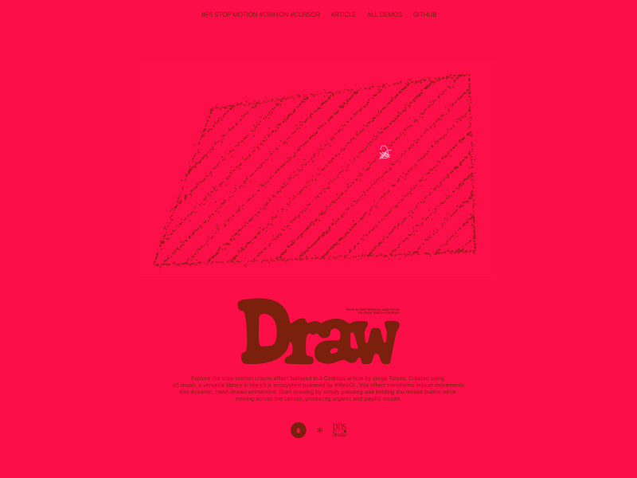

# Signature

An interactive web application that lets users create unique digital signatures using a stop-motion crayon effect. Built on top of the p5 Brush implementation by [Jorge Toloza](http://jorgetoloza.co), with added blockchain integration for minting signatures as NFTs as well as a game mode to challenge yourself to recreate classic signatures from the past, which AI regenerates then uses to compare your results.

## System Architecture

### Hybrid Implementation

The application uses a hybrid architecture combining React and vanilla JavaScript:

1. **Core Drawing Engine**

   - Vanilla JavaScript implementation using p5.js and p5.brush
   - Direct DOM manipulation for performance-critical drawing operations
   - WebGL-powered canvas rendering
   - Custom trail and animation system

2. **React Frontend**

   - Modern UI components and state management
   - Web3 integration using web3onboard
   - Responsive design and mobile support
   - Mode switching and UI controls

3. **Integration Layer**
   - Seamless communication between React and vanilla JS components
   - Shared state management
   - Event handling and propagation
   - Canvas lifecycle management

### Web3 Integration (web3onboard)

The application uses web3onboard for blockchain integration:

1. **Wallet Connection**

   - Multiple wallet support
   - Chain switching capabilities
   - Transaction signing
   - Account management

2. **Smart Contract Interaction**

   - NFT minting functionality
   - Signature verification
   - On-chain storage
   - Gas optimization

3. **State Management**
   - Wallet state persistence
   - Network status monitoring
   - Transaction history
   - Error handling

## Current Features

- Interactive canvas with stop-motion crayon effect
- Real-time drawing with mouse interactions
- WebGL-powered p5.js brush system
- Organic, hand-drawn animation style
- Dual-mode experience:
  - SIGNATURE: Create and save your unique digital signature
  - QUILL: Challenge yourself to recreate AI-generated signatures
- Web3 wallet integration
- NFT minting capabilities
- Cross-chain compatibility



[Tutorial on Codrops](https://tympanus.net/codrops/?p=)

[Demo](http://tympanus.net/Development/.../)

## Installation

Install dependencies:

```
npm install
```

Compile start a local server:

```
npm run dev
```

Create the build:

```
npm run build
```

## Technical Implementation Details

### Canvas Management

- Custom `CanvasManager` class for handling drawing operations
- Trail system for smooth animations
- WebGL optimization for performance
- Responsive canvas sizing
- Mode-specific rendering

### Web3 Integration

- web3onboard configuration
- Wallet connection flow
- Transaction handling
- Error management
- Network switching

### State Management

- React context for UI state
- Custom event system for canvas updates
- Mode switching logic
- Wallet state persistence

## Planned On-chain Features

Upcoming integration with the Zora Protocol will allow users to mint their signatures as NFTs:

### Core Features

- Timed drawing sessions for signature creation
- Capture and store drawing data on-chain
- Multiple minting options:
  - ERC-721: One-of-one unique signature NFTs
  - ERC-1155: Multiple editions of the same signature
  - Zora Protocol Coins: Create a token around your signature

### Technical Implementation Plan

1. **Drawing Session**

   - Add timer functionality
   - Implement drawing data capture
   - Preview and confirmation system

2. **Blockchain Integration**

   - Connect wallet functionality
   - Zora Protocol SDK integration
   - Smart contract deployment for minting options

3. **User Interface**

   - Timer controls and display
   - Minting options selection
   - Transaction status and confirmation

4. **Storage**
   - Drawing data storage on IPFS
   - Metadata generation for NFTs
   - On-chain signature verification

## Verifiable Randomness Integration

### QUILL Game Mode Enhancement

The QUILL game mode will be enhanced with verifiable randomness to ensure fair and unpredictable signature challenges:

1. **AI Signature Generation**

   - Chainlink VRF integration for random seed generation
   - AI-powered signature style variations
   - Verifiable randomness for challenge difficulty
   - Historical signature database with random selection

2. **Fair Play System**

   - Verifiable random seed for each game session
   - On-chain storage of challenge parameters
   - Transparent scoring system
   - Anti-cheat verification

3. **Technical Implementation**

   - Chainlink VRF contract integration
   - Smart contract for game state management
   - IPFS storage for signature data
   - On-chain verification of game results

4. **Future Enhancements**
   - Multiplayer signature challenges
   - Tournament system with verifiable randomness
   - AI-powered difficulty adjustment
   - Signature style evolution based on player performance

## Development Guidelines

### Code Structure

```
src/
├── components/          # React components
│   ├── SignatureCanvas.jsx
│   ├── DesktopSignatureControls.jsx
│   └── MobileSignatureControls.jsx
├── js/                  # Core drawing engine (vanilla JS)
│   ├── components/      # Canvas and drawing components
│   │   ├── canvas-manager.js
│   │   ├── mode-toggle.js
│   │   └── signature-controls/
│   │       ├── base-controls.js
│   │       ├── desktop-controls.js
│   │       └── mobile-controls.js
│   ├── pages/          # Page-specific implementations
│   │   └── index.js    # Main entry point
│   └── signature-capture.js
├── styles/             # Styling and animations
│   ├── app.css
│   └── index.scss
├── types/              # TypeScript type definitions
├── App.jsx            # Main React component
├── main.jsx           # React entry point
├── web3-config.js     # Web3 configuration
└── index.html         # HTML entry point
```

### Key Components

1. **Core Drawing Engine** (`/src/js/`)

   - `canvas-manager.js`: Handles canvas initialization and drawing operations
   - `mode-toggle.js`: Manages signature/quill mode switching
   - `signature-controls/`: UI controls for drawing operations

2. **React Components** (`/src/components/`)

   - `SignatureCanvas.jsx`: Main canvas wrapper component
   - `DesktopSignatureControls.jsx`: Desktop-specific controls
   - `MobileSignatureControls.jsx`: Mobile-specific controls

3. **Web3 Integration** (`/src/`)

   - `web3-config.js`: Web3onboard configuration and setup
   - Wallet connection and transaction handling

4. **Styling** (`/src/styles/`)
   - `app.css`: Global styles and animations
   - `index.scss`: SCSS styles and variables

### Best Practices

- Use vanilla JS for performance-critical operations
- React for UI components and state management
- Web3 integration through web3onboard
- Proper cleanup and event handling
- Responsive design principles

## Misc

Follow Jorge Toloza: [Website](https://jorgecapillo.co), [Instagram](https://instagram.com/jorgecapillo), [X](https://twitter.com/jorgecapillo), [GitHub](https://github.com/jorgecapillo)

Follow Codrops: [X](http://www.X.com/codrops), [Facebook](http://www.facebook.com/codrops), [GitHub](https://github.com/codrops), [Instagram](https://www.instagram.com/codropsss/)

## License

[MIT](LICENSE)

Made with :blue_heart: by [Jorge Toloza](https://jorgecapillo.co) and [Codrops](http://www.codrops.com)
